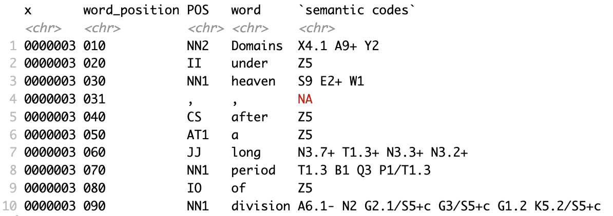
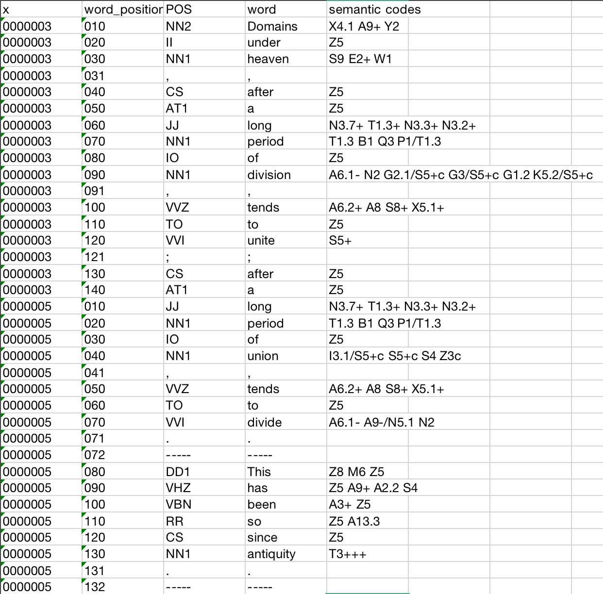
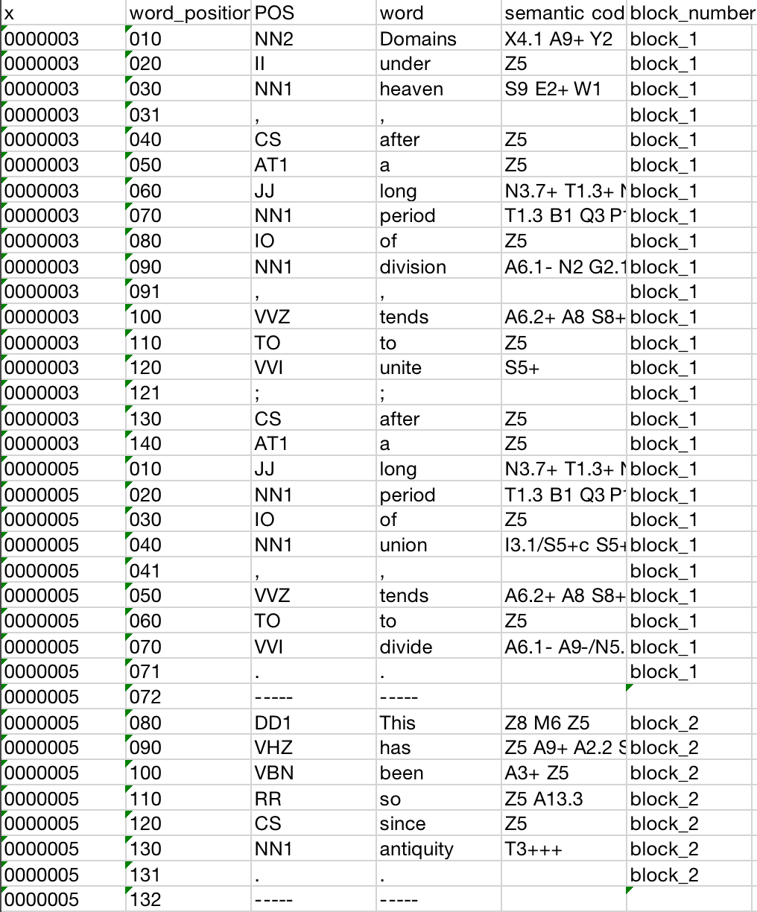
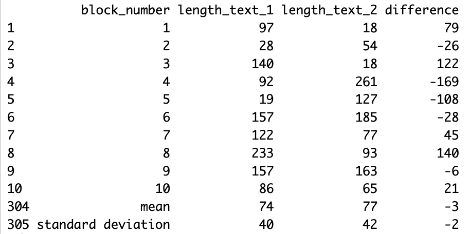
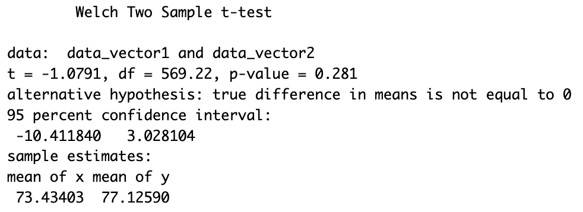
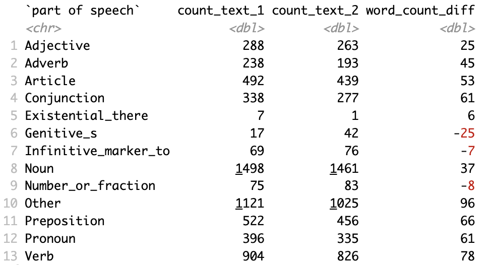
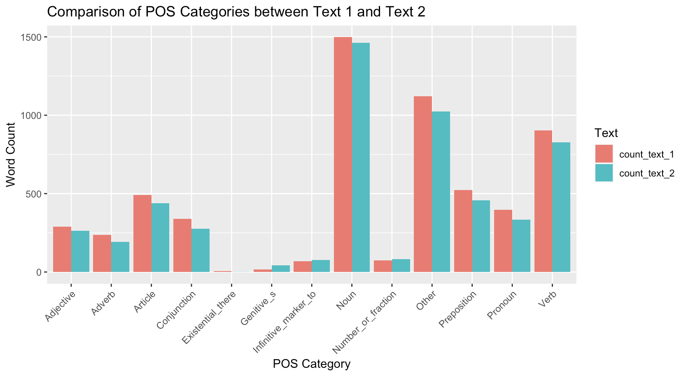

# A Corpus-Based Comparative Analysis of Two English Translations of 'Sanguo Yanyi'

> This is an academic solo project, a corpus-based comparative analysis using R. I am responsible for research design, data collection and analysis, result interpretation and presentation. 
>

# 01. Introduction
## 1.1 Background
This research focuses on a comparative analysis of two English translations of Sanguo Yanyi, a classic Chinese novel by Luo Guanzhong. The novel, known for its epic scope and rich characterizations, plays a significant role in Chinese literature. The translations under scrutiny are:
- *Romance of the Three Kingdoms* translated by *C. H. Brewett-Taylor*. First published by Shanghai: Kelly&Walsh in 1925. Its excerpt selected for analysis is hereinafter referred to as text_1.
- *A Historical Novel of Three Kingdoms* translated by *Moss Roberts*. First published by Berkeley and Los Angeles: University of California Press in 1991. Its excerpt selected for analysis is hereinafter referred to as text_2.

- Content of text_1 and text_2: For the analysis, considering the limitation on space and resource, only the first chapters are selected. When the texts are imported for POS and semantic tagging, the titles of the chapter are omitted.

## 1.2 Objectives
The primary objective is to analyze and compare the two translations in terms of sentence word length and part-of-speech (POS) tag frequency, to understand their translation strategies and adherence to the original text's style.

## 1.3 Research Question
- How do the translation strategies between the two versions differ in terms of sentence word length and POS tag usage?
- What might these differences suggest about each translator's approach to maintaining the original text's narrative style?

# 02. Data Collection and Methodology
The methodology involves annotating the texts with POS and semantic codes, followed by a comparative analysis on a sentence level using mean word lengths. A t-test examines the significance of differences, and frequency counts of each type of POS tag compare the texts' most and least frequent tags.

## 2.1 package dependencies

```r
library(tidyverse)
library(tidyr)
library(dplyr)
library(readr)
library(readxl)
library(openxlsx)
```

## 2.2 Data Cleaning
This research used the [UCREL Semantic Analysis System (USAS)](https://ucrel-api.lancaster.ac.uk/usas/tagger.html) for both POS and semantic tagging.

The output from USAS tool is stored in a .xlsx file, with no column names, and for words that have multiple semantic codes, the values are stored in separate columns. This step is to name each columns, and to concatenate the separated semantic codes into one column.

```r
df <- read_excel(file.choose(), col_names = FALSE, col_types = "text")
df <- cbind(df[, 1:4], apply(df[, 5:ncol(df)], 1, function(x) paste(x, collapse = " ")))
df <- df[, 1:5]
write.xlsx(df, "output.xlsx", rowNames = FALSE, colNames = FALSE)
df <- read_excel(file.choose(), col_names = c("x", "word_position", "POS", "word", "semantic codes"))[, 1:5]
write.xlsx(df, "renamed.xlsx", rowNames = FALSE, colNames = TRUE)
```
Sample output taken from text_1, see the excerpt of tagged text_1 as below:



F1. excerpt of tagged text_1

```{r eval=FALSE}
text_1 <- read_excel(file.choose())
head(text_1,10)
```

The first two columns represent the position of the word in the text. The third column is the part-of-speech tag of the word. The fourth column is the word itself. The fifth column is the word's semantic codes.

Some words have multiple semantic codes. According to USAS code category, e.g. X4.1 means "Mental object: Conceptual object", A9+ means "Getting and giving; possession (the trailing "+" indicates a positive connotation)", Y2 means "Information technology and computing".

## 2.3 Corpus Annotation

The two texts will be compared on a block level. A block is labeled by "-----" in the tagged .xlsx file. The divider appears at the end of every complete sentence, see the example below.



F2. example of a block and divider

```r
df <- read_excel(file.choose())
pos_positions <- which(df$POS == "-----")
df$block_number <- NA
for (i in 1:length(pos_positions)) {
  if (i == 1) {
    df$block_number[1:pos_positions[i]] <- paste0("block_", i)
  } else {
    df$block_number[(pos_positions[i - 1] + 1):pos_positions[i]] <- paste0("block_", i)
  }
}
df$block_number[df$POS == "-----"] <- " "
write.xlsx(df, "output.xlsx", rowNames = FALSE, colNames = TRUE)
```

Now the file looks like the figure below.


F3. text_1 with block numbers

Text_1 has 303 blocks, text_2 has 279 blocks. This could indicates that the translation of text_2 contains more summarization and translator's interpretation.  

You can see that the dividers are not marked with block numbers, so that they won't be counted in the block length.

## 2.4 Mean Word Length Comparison

A t-test is a statistical hypothesis test used to determine if there is a significant difference between the means of two groups. Therefore the null hypothesis for this experiment is "there is no difference between the length in words of text_1 and text_2".

### 2.4.1 Compare the lengths on a block-level

```{r eval=FALSE}
text_1 <- read_excel("Desktop/asa_finalProject/corpus materials/text1_tagged_blockn.xlsx") %>%
  filter(!is.na(block_number) & !is.na(word))  
text_2 <- read_excel("Desktop/asa_finalProject/corpus materials/text2_tagged_blockn.xlsx") %>%
  filter(!is.na(block_number) & !is.na(word))  

text_1 <- text_1 %>% group_by(block_number) %>% summarize(length_text_1 = sum(nchar(word)))
text_2 <- text_2 %>% group_by(block_number) %>% summarize(length_text_2 = sum(nchar(word)))

merged_data <- full_join(text_1, text_2, by = "block_number")
merged_data <- merged_data %>% mutate(difference = length_text_1 - length_text_2)

mean_text_1 <- mean(merged_data$length_text_1)
mean_text_2 <- mean(merged_data$length_text_2)

sd_text_1 <- sd(merged_data$length_text_1)
sd_text_2 <- sd(merged_data$length_text_2)

mean_difference <- mean(merged_data$difference)
sd_difference <- sd(merged_data$difference)

summary_table <- merged_data %>%
  select(block_number, length_text_1, length_text_2, difference)
write.xlsx(summary_table, "Comparison of length in words.xlsx", rowNames = FALSE)
```

### 2.4.2 Calculate the mean value and standard deviation

```{r}
data <- read.xlsx("Desktop/asa_finalProject/corpus materials/Comparison of length in words.xlsx")
mean_length_text_1 <- mean(data$length_text_1, na.rm = TRUE)
mean_length_text_2 <- mean(data$length_text_2, na.rm = TRUE)
sd_length_text_1 <- sd(data$length_text_1, na.rm = TRUE)
sd_length_text_2 <- sd(data$length_text_2, na.rm = TRUE)
difference_mean <- mean_length_text_1 - mean_length_text_2
difference_sd <- sd_length_text_1 - sd_length_text_2

new_rows <- data.frame(
  block_number = c("mean", "standard deviation"),
  length_text_1 = c(mean_length_text_1, sd_length_text_1),
  length_text_2 = c(mean_length_text_2, sd_length_text_2),
  difference = c(difference_mean, difference_sd)
)

new_data <- rbind(data, new_rows)
write.xlsx(new_data, "t-test_result.xlsx", rowNames = FALSE)
```

### 2.4.3 Organize the output format

```{r eval=FALSE}
t_result <- read.xlsx("Desktop/asa_finalProject/corpus materials/t-test_result.xlsx")
t_result[,2:4] <- round(t_result[,2:4],0)
head_rows <- head(t_result, 10)
tail_rows <- tail(t_result, 2)
print(rbind(head_rows, tail_rows))
```

See the organized output below:


F4. word length comparison

### 2.4.4 Test the null hypothesis

```{r eval=FALSE}
t_test_result <- read_excel("Desktop/asa_finalProject/corpus materials/t-test_result.xlsx")
raw_data_text_1 <- t_test_result[[2]][2:304]
raw_data_text_2 <- t_test_result[[3]][2:280]
data_vector1 <- as.numeric(raw_data_text_1)
data_vector2 <- as.numeric(raw_data_text_2)

t_test_result <- t.test(data_vector1, data_vector2)
print(t_test_result)
```

See the t-test result as below:


F5. t-test result

Now we have a comparison of words length of text_1 and text_2. Together with the mean value and standard deviation.

## 2.5 POS Analysis

To find out the frequency of each type of POS tags, firstly they will be categorized into 13 kinds, by the following patterns:
- Article: Starts with "AT"
- Conjunction: "C"
- Existential_there: "EX"
- Genitive_s: "GE"
- Preposition: Starts with "I"
- Adjective: Starts with "JJ", "JJR", "JJS"
- Number or fraction: Starts with "MC"
- Noun: Starts with "N"
- Pronoun: Starts with "P", or starts with "WP", or is "APPGE".
- Adverb: Starts with "R"
- Infinitive marker_to: "TO"
- Verb: Starts with "V"
- Other: Any other types that do not fit into the above categories

### 2.5.1 Categorize POS tags

```{r}
df1 <- read.xlsx("Desktop/asa_finalProject/corpus materials/text1_tagged_blockn.xlsx")
df2 <- read.xlsx("Desktop/asa_finalProject/corpus materials/text2_tagged_blockn.xlsx")

categorize_POS <- function(tag) {
  case_when(
    grepl("^AT", tag) ~ "Article",
    grepl("^C", tag) ~ "Conjunction",
    grepl("^PDT|^DT|^WDT", tag) ~ "Determiner",
    tag == "EX" ~ "Existential_there",
    tag == "GE" ~ "Genitive_s",
    grepl("^I", tag) ~ "Preposition",
    grepl("^JJ|^JJR|^JJS", tag) ~ "Adjective",
    grepl("^MC", tag) ~ "Number_or_fraction",
    grepl("^N", tag) ~ "Noun",
    grepl("^P|^WP|^APPGE", tag) ~ "Pronoun",
    grepl("^R", tag) ~ "Adverb",
    tag == "TO" ~ "Infinitive_marker_to",
    grepl("^V", tag) ~ "Verb",
    tag == "NEG" ~ "Negation",
    tag == "FW" ~ "Formulas_foreign_words_interjections_letters",
    TRUE ~ "Other"
  )
}
df1 <- df1 %>% mutate(POS_category = categorize_POS(POS))
df2 <- df2 %>% mutate(POS_category = categorize_POS(POS))

write.xlsx(df1, "text_1_POS_category.xlsx", rowNames = FALSE)
write.xlsx(df2, "text_2_POS_category.xlsx", rowNames = FALSE)
```

### 2.5.2 Count each POS category

```{r}
pos_1 <- read_excel("Desktop/asa_finalProject/corpus materials/text_1_POS_category.xlsx") %>% filter(!is.na(word))
pos_2 <- read_excel("Desktop/asa_finalProject/corpus materials/text_2_POS_category.xlsx") %>% filter(!is.na(word))

count_text_1 <- pos_1 %>%
  group_by(POS_category) %>%
    summarise(count_text_1 = n()) %>%
      mutate(count_text_1 = as.numeric(count_text_1))
count_text_2 <- pos_2 %>%
  group_by(POS_category) %>%
    summarise(count_text_2 = n()) %>%
      mutate(count_text_2 = as.numeric(count_text_2))

result <- full_join(count_text_1, count_text_2, by = "POS_category") %>%
  rename("part of speech"=POS_category) %>%
    mutate(difference = count_text_1 - count_text_2)
names(result)[4] <- "word_count_diff"

print(result)
```

See the counts of POS tags as the table below:


F6. POS counts


Now that we have a comparison of POS category counts between the two texts, use ggplot to visualize the comparison in a bar chart, for better analysis.

```r
install.packages("reshape2")
library(reshape2)
combined_counts <- merge(count_text_1, count_text_2, by = "POS_category", suffixes = c("_text1", "_text2"))
melted_counts <- melt(combined_counts, id.vars = "POS_category", variable.name = "Text", value.name = "Word_Count")

ggplot(melted_counts, aes(x = POS_category, y = Word_Count, fill = Text)) +
  geom_bar(stat = "identity", position = "dodge") +
  labs(title = "Comparison of POS Categories between Text_1 and Text_2",
       x = "POS Category", y = "Word Count") +
  theme(axis.text.x = element_text(angle = 45, hjust = 1))
knitr::opts_chunk$set(echo = TRUE)
```

See the comparative result in the bar chart below:


F7. Comparison of POS Categories between Text_1 and Text_2

# 03. Conclusion
## 3.1 Findings and Interpretation
From the result of mean word length comparison, we can observe and conclude:
- Despite that text_2 has 24 blocks less than text_1, it has a higher mean word count (77) compared to text_1 (74). On average, the sentences in text_2 contain more words compared to those in text_1. Text_2 may use longer sentences or more complex language compared to text_1, by combining two or three sentences from the Chinese text into English translation.
- Two texts have a similar standard deviation (around 40-42), suggesting that while the mean word counts differ, the variability within each text is comparable. It indicates consistent writing styles or patterns within each text.
- The null hypothesis stands: There is no significant difference in the mean word lengths of text_1 and text_2.
  - t-value: The t-value is -1.0791, it indicates that the mean word length of text_1 is slightly lower than that of text_2, but the magnitude of this difference is not substantial.
  - Degrees of Freedom (df): The degrees of freedom for the t-test is approximately 569.22. Indicating a precise estimation.
  - p-value: The p-value is 0.281, greater than the conventional significance level of 0.05, suggesting that we fail to reject the null hypothesis. In other words, there is no significant difference in the mean word lengths of text_1 and text_2.

From the result of POS comparison, the two texts have the same highest and lowest categories of POS. The highest are noun, verb, and article. The lowest are existential "there", genitive "'s", and number or fraction. This suggests a similar translation strategy of the two texts, in line with their similarity in word lengths.
- Sanguo Yanyi is known for its extensive cast of characters, epic battles and political intrigues. The high usage of nouns reflects the narrative's emphasis on character development and portrayal. Whereas the high usage of verbs reflects the dynamic and action-oriented nature of the translation. It can be concluded that both translations follow the original storytelling style of the Chinese novel.
- Text_1 has less usage of genitive "'s" than text_2. According to a translation analysis by Yanyi (2023, p. 6), text_1 appears to “omit part of the source text and source culture to decrease the foreignness of his translation”. This can be reflected in the previous finding that text_1 has more words and shorter sentences -- text_1 simplifies certain grammatical structures by using less genitive "'s", but more nouns and verbs.

## 3.2 Overall Conclusion
Overall, we can draw the following conclusions:
- There is no significant difference in the mean word lengths of text_1 and text_2.
- Text_1 is characterized by more words, but shorter and simpler sentences. On the contrary, sentences in text_2 are longer and more complex.
- Both texts use more nouns, verbs, and articles than other types of POS, suggesting an alignment with the writing style of the original novel.

## 3.3 Limitation
- This analysis only covers the first chapter of the source novel, the majority of which is background and character introduction. This cannot represent the whole image of their translation strategies. 
- Additionally, The analysis of semantic usages is not included in this project due to limitations of time and resource. Comparison of the usage of positive and negative emotional words can be conducted, it can further support the reflection of their translation strategies.
