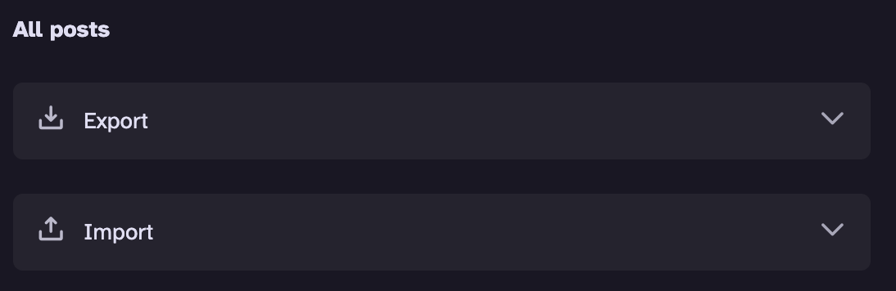
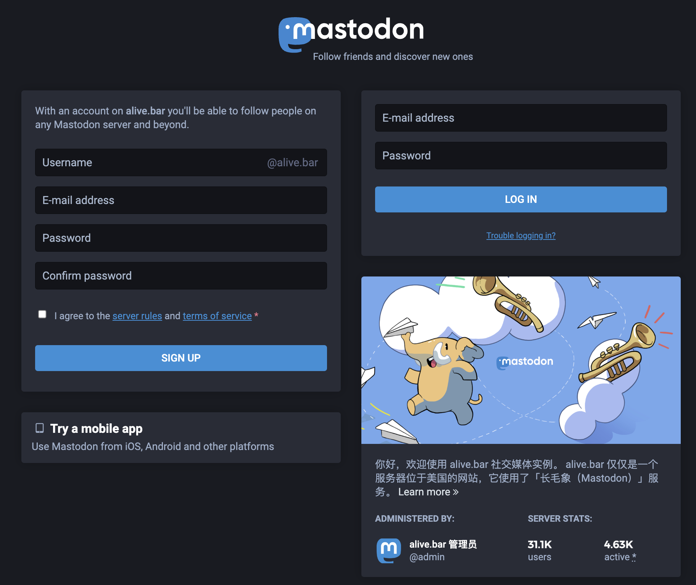
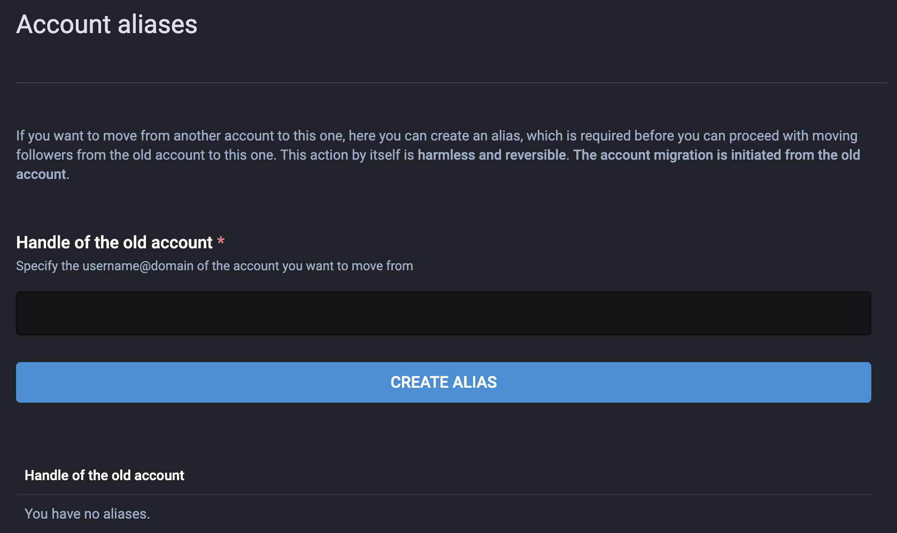
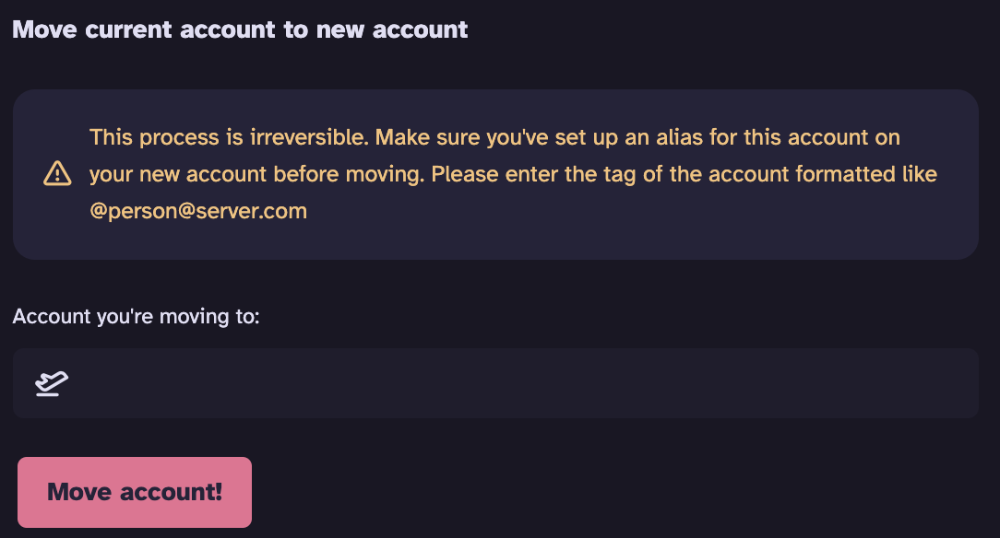
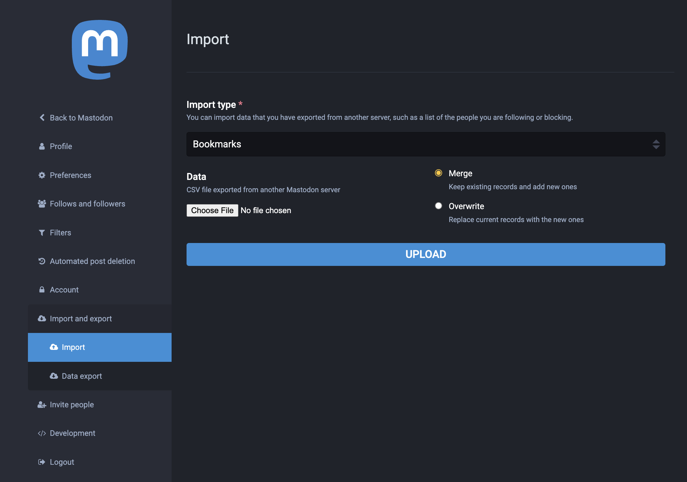

# How to move from Firefish to Mastodon

> This is a step-by-step guide of account migration from Firefish to Mastodon. Target readers are Fediverse users who are unfamiliar with different Fediverse projects.  
> 
This tutorial guides you to migrate your current Firefish account to a new Mastodon account.

Results:

In your current Firefish account:
- There will be a note displaying: **User has moved to a new account: @username@server.com**;
- Your will not be able to make new posts;
- Old posts will remain untouched.

In your new Mastodon account:
- Some data can be imported: your followers, followed users, user lists, muted users, and blocked users;
- Some data can NOT be imported: your old posts, likes, bookmarks.

**Table of Contents**
- [How to move from Firefish to Mastodon](#how-to-move-from-firefish-to-mastodon)
- [00. Prerequisites](#00-prerequisites)
- [01. Export Your Data](#01-export-your-data)
- [02. Create A New Mastodon Account](#02-create-a-new-mastodon-account)
- [03. Configure Your New Account](#03-configure-your-new-account)
  - [3.1 Back-Reference to Your Old Firefish Account](#31-back-reference-to-your-old-firefish-account)
  - [3.2 Set Alias to Your New Mastodon Account](#32-set-alias-to-your-new-mastodon-account)
- [04. Move Current Account to New Account](#04-move-current-account-to-new-account)
  - [4.1 Before this step, make sure:](#41-before-this-step-make-sure)
  - [4.2 When you are ready to migrate!](#42-when-you-are-ready-to-migrate)
  - [4.3 After this step:](#43-after-this-step)
- [05. Import Your Data into New Account](#05-import-your-data-into-new-account)
- [06. Finally](#06-finally)
- [07. FAQs](#07-faqs)
- [08. See Also](#08-see-also)
   
# 00. Prerequisites 
Before moving forward, the reader should have:
- a basic understanding of [Fediverse](https://joinfediverse.wiki/What_is_the_Fediverse%3F);
- an existing Firefish account;
- a Mastodon server that you choose to be the destination of this migration. 
  
# 01. Export Your Data
**Note that you can NOT export your *likes* and *bookmarks*. Consider about this before you migrate your account.**
- Go to `Settings` > `Other Settings`> `Import/Export Data`;
- Click `Export`;
- Wait for a while, you will find the exported files in `Settings` > `Basic Settings`> `Drive`. Posts will be stored in a `.json` file, data of users will be stored in a `.csv` file.

You can export the following types of data:
- Posts,
- Followed users,
- User lists,
- Muted users,
- Blocked users.
  
# 02. Create A New Mastodon Account
Submit your registration application at your destination server and wait for approval.

Here is an example of the registration interface of [alive.bar](https://alive.bar/about), you can find more instances of your interest on the [Mastodon Server List](https://joinmastodon.org/servers).

 

# 03. Configure Your New Account
## 3.1 Back-Reference to Your Old Firefish Account 
Your new account must first be configured to back-reference the old one. 
- Make your first post in your new account, mention@ your current account. 
  
## 3.2 Set Alias to Your New Mastodon Account 
- Go to `Edit profile` > `Account`;
- Scroll down to **Moving from a different account**; 
- Click `create an account alias`;
- Enter the address of your current Firefish account; 
- Click `CREATE ALIAS`.
  

# 04. Move Current Account to New Account
## 4.1 Before this step, make sure:
- Your data is exported;
- Your new account is configured.

## 4.2 When you are ready to migrate!
Move back to your current Firefish account. 
- Go to `Settings` > `Other Settings`>`Migration`; 
- Find **Move current account to new account** pane;
- Enter the address of your new home in Fediverse, formatted as `@username@server.com`;
- Click `Move account!`.
  

## 4.3 After this step:
- Your current account will be frozen, you can not make new posts with this account. But your old posts continue to exist. 
- All the followers of your old account will automatically follow your new account.
- If your new account requires follow request, you have to accept your old followers manually. 

# 05. Import Your Data into New Account
- Download the files you want to migrate from Firefish `Drive`;
- Go to Mastodon `Edit profile` > `Import and export` > `Import`;
- Choose your files and upload. 

  
# 06. Finally
Even though there will be a note on your current account showing that you have moved, it is the best if you set up your new profile, and make a new post to tell your friends who you are, before they remove this blank account from their following list. Specifically, you can:
- direct your old account in your Bio;
- utilize pinned posts for visibility.

Now, enjoy your social life in Fediverse! 

# 07. FAQs
Q1: What is the relation between Firefish and Mastodon?

A1: As two separate projects, Firefish and Mastodon differ in features e.g. text limits, web UI, app compatibility, etc. But they are both decentralized, open-source social networking platforms that contribute to the Fediverse's ecosystem. 

Q2: What if I want to keep my old posts?

A2: You can import your posts as bookmarks into your new account: 
- Download your posts from `Import/Export Data`, you will have a `.json` file containing all your posts stored in your Firefish `Drive`;
- Convert the `.json` file into a `.csv` file;
- Import the `.csv` file into your new account, from Mastodon `Edit profile` > `Import and export` > `Import` > Import type: `bookmarks` > `Choose File` > `upload`.

Q3: When I click `Move account!` in Firefish, it says "Remote account doesn't have proper 'Known As' alias. Did you remember to set it?" But I already set alias to my new account. Why?

A3: If you have successfully set alias to your new account, this might happen because you did not back reference to your current account. Use your new account to make a post, mention@ your current Firefish account, then you will be able to move! 

Q4: Are the steps the same if I want to migrate from Mastodon to Firefish?

A4: Not exactly. Mastodon and Firefish have different interface, different ways of exporting and importing data. You can refer to [this guidance](https://wedistribute.org/2023/07/how-to-move-from-mastodon-to-firefish/) if needed.

# 08. See Also
- [Fediverse official website](https://fediverse.party/en/fediverse/)
- [Firefish official documentation: Migrating your Fediverse account](https://joinfirefish.org/docs/en/account-migration/)
- [Firefish user community](https://fishtank.firefishsoftware.com/user-community)
- [Mastodon archive viewer](https://github.com/slashyn/mastodon-archive-viewer-modified)