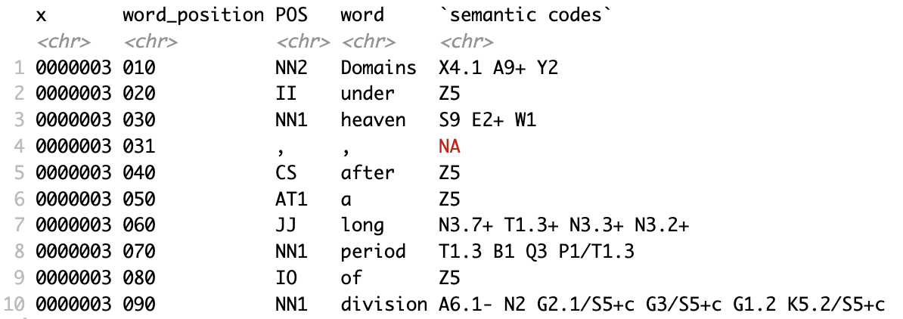
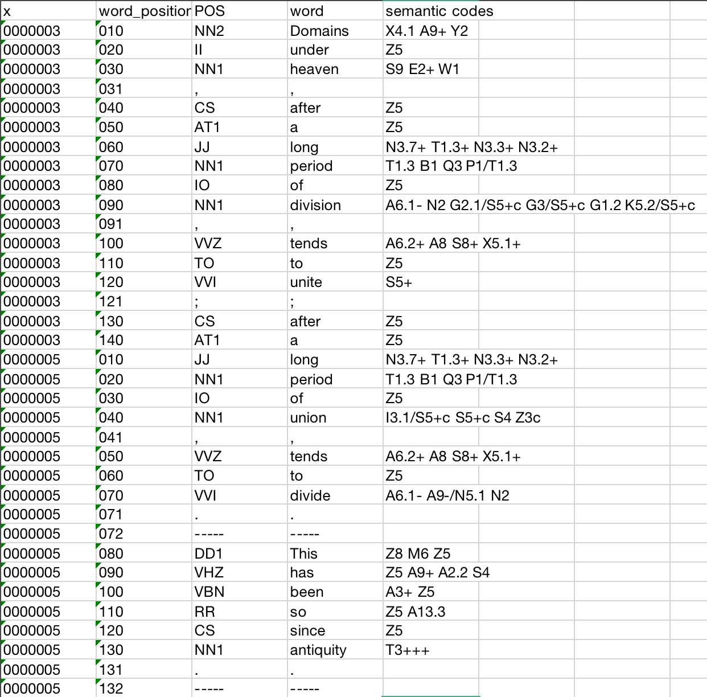
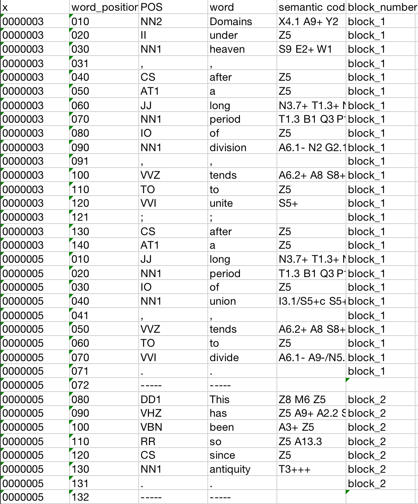
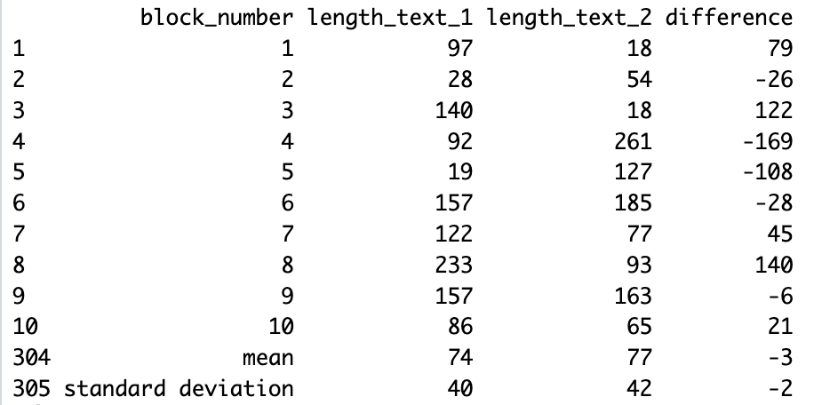
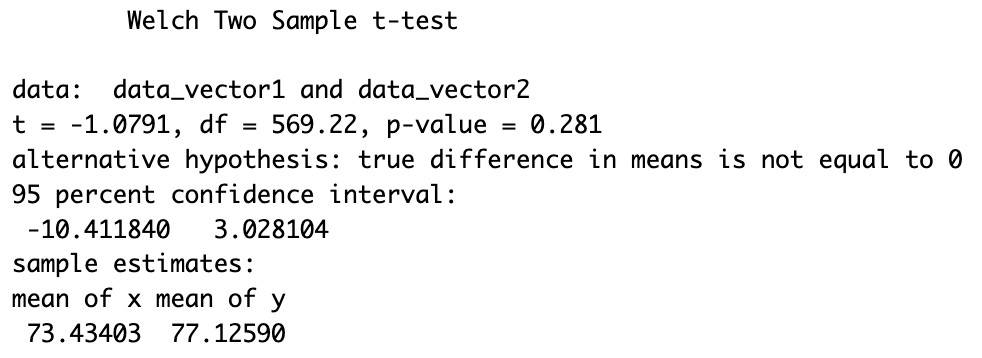
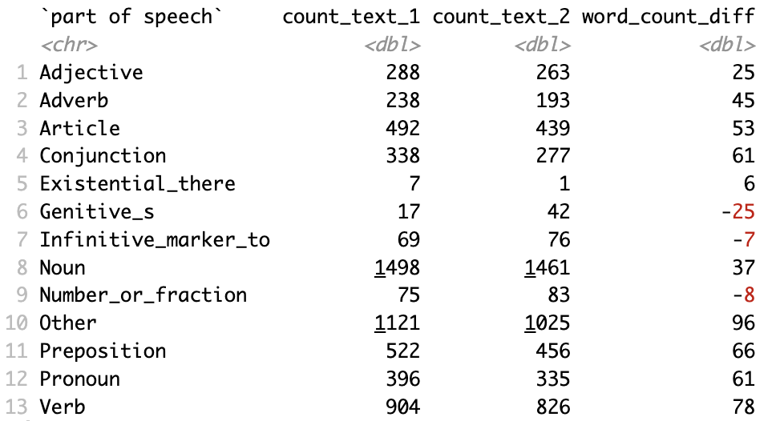
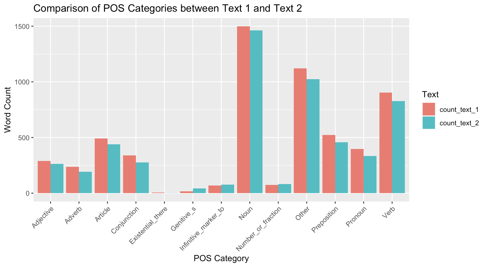

# A Corpus-Based Comparative Analysis of Two English Translations of "Sanguo Yanyi"

Jump to the writing sample from [here](#project-content). 

### Context
This was an academic solo project, using R packages to analyze the linguistic features of two written corpora. This project was completed within a month, the audience is any corpus linguistic student who is interested in applying R to linguistic research. 

### Problem
Despite the critical and cultural importance of "Sanguo Yanyi", there has been limited quantitative analysis on how different translations handle the original's narrative complexity and linguistic richness. Questions remain about how translation strategies affect the readability, narrative style, and fidelity to the source material. 

### Contribution
With the reference to similar corpus-based studies on translation strategies, I took initiative on:
- Developing the research plan.
- Compiling and annotating the corpora. 
- Analyzing the linguistic features.  
- Producing documentation and presentation. 

### Impact
By quantifying differences in translation strategies, this research sheds light on the nuanced decisions translators make and their consequences for narrative style and reader engagement. Additionally, the project underscores the potential of computational linguistics tools in literary analysis, opening avenues for further research into the linguistic characteristics of translated texts. 

---

<a id="project-content"></a>

**Table of Contents**
- [A Corpus-Based Comparative Analysis of Two English Translations of "Sanguo Yanyi"](#a-corpus-based-comparative-analysis-of-two-english-translations-of-sanguo-yanyi)
    - [Context](#context)
    - [Problem](#problem)
    - [Contribution](#contribution)
    - [Impact](#impact)
  - [01. Introduction](#01-introduction)
    - [1.1 Project Background](#11-project-background)
    - [1.2 Objectives](#12-objectives)
  - [1.3 Research Question](#13-research-question)
  - [02. Getting Started](#02-getting-started)
    - [2.1 Prerequisites](#21-prerequisites)
    - [2.2 Installation and Setup](#22-installation-and-setup)
    - [2.3 package dependencies](#23-package-dependencies)
  - [03. Methodology](#03-methodology)
    - [3.1 Data Collection](#31-data-collection)
    - [3.2 Corpus Annotation](#32-corpus-annotation)
    - [3.3 Data Cleaning](#33-data-cleaning)
  - [04. Analysis Techniques](#04-analysis-techniques)
    - [4.1 Mean Word Length Comparison](#41-mean-word-length-comparison)
    - [4.2 POS Frequency Analysis](#42-pos-frequency-analysis)
  - [05. Results](#05-results)
    - [5.1 Mean Word Length Comparison](#51-mean-word-length-comparison)
    - [5.2 POS Frequency Analysis](#52-pos-frequency-analysis)
  - [06. Discussion](#06-discussion)
    - [6.1 Interpretation of Findings](#61-interpretation-of-findings)
    - [6.2 Implications](#62-implications)
  - [07. Conclusion and Future Work](#07-conclusion-and-future-work)
    - [7.1 Summary of Key Findings](#71-summary-of-key-findings)
    - [7.2 Limitations](#72-limitations)
    - [7.3 Suggestions for Future Research](#73-suggestions-for-future-research)
  - [08. Appendices](#08-appendices)

## 01. Introduction
### 1.1 Project Background
This research compares the linguistic features of two English translations of "Sanguo Yanyi", a classic Chinese novel by Luo Guanzhong. The novel, known for its epic scope and rich characterizations, plays a significant role in Chinese literature. 

The materials under scrutiny are the first chapters of the following two translations:
- *Romance of the Three Kingdoms* translated by *C. H. Brewett-Taylor*. First published by Shanghai: Kelly&Walsh in 1925. Its excerpt selected for analysis is hereinafter referred to as **text_1**.
- *A Historical Novel of Three Kingdoms* translated by *Moss Roberts*. First published by Berkeley and Los Angeles: University of California Press in 1991. Its excerpt selected for analysis is hereinafter referred to as **text_2**.

### 1.2 Objectives
- To analyze and compare the two translations regarding sentence word length and part-of-speech (POS) tag frequency.
- To deduce the translation strategies employed and their fidelity to the original text's narrative style.

## 1.3 Research Question
- How do translation strategies between the two versions differ in terms of sentence word length and POS tag usage?
- What might these differences suggest about each translator's approach to maintaining the original text's narrative style?

## 02. Getting Started
### 2.1 Prerequisites
- Basic knowledge of R programming.
- Familiarity with linguistic analysis concepts.

### 2.2 Installation and Setup
Refer to Appendix A for detailed instructions on installing R and the necessary packages for this project.

### 2.3 package dependencies

```r
library(tidyverse)
library(tidyr)
library(dplyr)
library(readr)
library(readxl)
library(openxlsx)
```

## 03. Methodology 
### 3.1 Data Collection
- Find publicly available .pdf version of the two translations, 
- Select and convert the first chapters into .txt,
- Save the two .txt files for later annotation. 

### 3.2 Corpus Annotation
This research uses the [UCREL Semantic Analysis System (USAS)](https://ucrel-api.lancaster.ac.uk/usas/tagger.html) for both POS and semantic tagging.
- Go on the USAS platform, import the two .txt raw texts,
- Convert the web output into two .xlsx files,
- Name them as "text_1.xlsx" and "text_2.xlsx".

### 3.3 Data Cleaning
In the two .xlsx files, 
- Rename the first five columns as "x", "word_position", "POS", "word", "semantic codes",
- Concatenate all the semantic codes after the fifth column into the fifth column.

```r
df <- read_excel(file.choose(), col_names = FALSE, col_types = "text")
df <- cbind(df[, 1:4], apply(df[, 5:ncol(df)], 1, function(x) paste(x, collapse = " ")))
df <- df[, 1:5]
write.xlsx(df, "output.xlsx", rowNames = FALSE, colNames = FALSE)
df <- read_excel(file.choose(), col_names = c("x", "word_position", "POS", "word", "semantic codes"))[, 1:5]
write.xlsx(df, "renamed.xlsx", rowNames = FALSE, colNames = TRUE)
```
Sample output taken from text_1, see the excerpt of tagged text_1 as below:



F1. excerpt of tagged text_1

## 04. Analysis Techniques
### 4.1 Mean Word Length Comparison
In text_1.xlsx and text_2.xlsx,
- Label each blocks (i.e. full sentences) with a block number:
  - A block is labeled by "-----" in the tagged .xlsx file. The divider appears at the end of every complete sentence, see the example below.



F2. example of a block and divider

```r
df <- read_excel(file.choose())
pos_positions <- which(df$POS == "-----")
df$block_number <- NA
for (i in 1:length(pos_positions)) {
  if (i == 1) {
    df$block_number[1:pos_positions[i]] <- paste0("block_", i)
  } else {
    df$block_number[(pos_positions[i - 1] + 1):pos_positions[i]] <- paste0("block_", i)
  }
}
df$block_number[df$POS == "-----"] <- " "
write.xlsx(df, "output.xlsx", rowNames = FALSE, colNames = TRUE)
```

Now the file looks like the figure below.


F3. text_1 with block numbers

Text_1 has 303 blocks, text_2 has 279 blocks. 

- Compare the word lengths on a block-level:

```r
text_1 <- read_excel("Desktop/asa_finalProject/corpus materials/text1_tagged_blockn.xlsx") %>%
  filter(!is.na(block_number) & !is.na(word))  
text_2 <- read_excel("Desktop/asa_finalProject/corpus materials/text2_tagged_blockn.xlsx") %>%
  filter(!is.na(block_number) & !is.na(word))  

text_1 <- text_1 %>% group_by(block_number) %>% summarize(length_text_1 = sum(nchar(word)))
text_2 <- text_2 %>% group_by(block_number) %>% summarize(length_text_2 = sum(nchar(word)))

merged_data <- full_join(text_1, text_2, by = "block_number")
merged_data <- merged_data %>% mutate(difference = length_text_1 - length_text_2)

mean_text_1 <- mean(merged_data$length_text_1)
mean_text_2 <- mean(merged_data$length_text_2)

sd_text_1 <- sd(merged_data$length_text_1)
sd_text_2 <- sd(merged_data$length_text_2)

mean_difference <- mean(merged_data$difference)
sd_difference <- sd(merged_data$difference)

summary_table <- merged_data %>%
  select(block_number, length_text_1, length_text_2, difference)
write.xlsx(summary_table, "Comparison of length in words.xlsx", rowNames = FALSE)
```

- Calculate the mean value and standard deviation:

```r
data <- read.xlsx("Desktop/asa_finalProject/corpus materials/Comparison of length in words.xlsx")
mean_length_text_1 <- mean(data$length_text_1, na.rm = TRUE)
mean_length_text_2 <- mean(data$length_text_2, na.rm = TRUE)
sd_length_text_1 <- sd(data$length_text_1, na.rm = TRUE)
sd_length_text_2 <- sd(data$length_text_2, na.rm = TRUE)
difference_mean <- mean_length_text_1 - mean_length_text_2
difference_sd <- sd_length_text_1 - sd_length_text_2

new_rows <- data.frame(
  block_number = c("mean", "standard deviation"),
  length_text_1 = c(mean_length_text_1, sd_length_text_1),
  length_text_2 = c(mean_length_text_2, sd_length_text_2),
  difference = c(difference_mean, difference_sd)
)

new_data <- rbind(data, new_rows)
write.xlsx(new_data, "t-test_result.xlsx", rowNames = FALSE)
```

- Organize the output format:

```r
t_result <- read.xlsx("Desktop/asa_finalProject/corpus materials/t-test_result.xlsx")
t_result[,2:4] <- round(t_result[,2:4],0)
head_rows <- head(t_result, 10)
tail_rows <- tail(t_result, 2)
print(rbind(head_rows, tail_rows))
```

See the organized output below:


F4. word length comparison

- Test the null hypothesis:
The null hypothesis for this research is: There is no significant difference between the mean word lengths in text_1 and text_2. 

```r
t_test_result <- read_excel("Desktop/asa_finalProject/corpus materials/t-test_result.xlsx")
raw_data_text_1 <- t_test_result[[2]][2:304]
raw_data_text_2 <- t_test_result[[3]][2:280]
data_vector1 <- as.numeric(raw_data_text_1)
data_vector2 <- as.numeric(raw_data_text_2)

t_test_result <- t.test(data_vector1, data_vector2)
print(t_test_result)
```

See the t-test result as below:


F5. t-test result

Now we have a comparison of words length of text_1 and text_2. Together with the mean value and standard deviation.

### 4.2 POS Frequency Analysis
- Categorize all the POS tags into 13 kinds, based on the following patterns:
  - Article: Starts with "AT"
  - Conjunction: "C"
  - Existential_there: "EX"
  - Genitive_s: "GE"
  - Preposition: Starts with "I"
  - Adjective: Starts with "JJ", "JJR", "JJS"
  - Number or fraction: Starts with "MC"
  - Noun: Starts with "N"
  - Pronoun: Starts with "P", or starts with "WP", or is "APPGE".
  - Adverb: Starts with "R"
  - Infinitive marker_to: "TO"
  - Verb: Starts with "V"
  - Other: Any other types that do not fit into the above categories

```r
df1 <- read.xlsx("Desktop/asa_finalProject/corpus materials/text1_tagged_blockn.xlsx")
df2 <- read.xlsx("Desktop/asa_finalProject/corpus materials/text2_tagged_blockn.xlsx")

categorize_POS <- function(tag) {
  case_when(
    grepl("^AT", tag) ~ "Article",
    grepl("^C", tag) ~ "Conjunction",
    grepl("^PDT|^DT|^WDT", tag) ~ "Determiner",
    tag == "EX" ~ "Existential_there",
    tag == "GE" ~ "Genitive_s",
    grepl("^I", tag) ~ "Preposition",
    grepl("^JJ|^JJR|^JJS", tag) ~ "Adjective",
    grepl("^MC", tag) ~ "Number_or_fraction",
    grepl("^N", tag) ~ "Noun",
    grepl("^P|^WP|^APPGE", tag) ~ "Pronoun",
    grepl("^R", tag) ~ "Adverb",
    tag == "TO" ~ "Infinitive_marker_to",
    grepl("^V", tag) ~ "Verb",
    tag == "NEG" ~ "Negation",
    tag == "FW" ~ "Formulas_foreign_words_interjections_letters",
    TRUE ~ "Other"
  )
}
df1 <- df1 %>% mutate(POS_category = categorize_POS(POS))
df2 <- df2 %>% mutate(POS_category = categorize_POS(POS))

write.xlsx(df1, "text_1_POS_category.xlsx", rowNames = FALSE)
write.xlsx(df2, "text_2_POS_category.xlsx", rowNames = FALSE)
```

- Count each POS frequency:

```r
pos_1 <- read_excel("Desktop/asa_finalProject/corpus materials/text_1_POS_category.xlsx") %>% filter(!is.na(word))
pos_2 <- read_excel("Desktop/asa_finalProject/corpus materials/text_2_POS_category.xlsx") %>% filter(!is.na(word))

count_text_1 <- pos_1 %>%
  group_by(POS_category) %>%
    summarise(count_text_1 = n()) %>%
      mutate(count_text_1 = as.numeric(count_text_1))
count_text_2 <- pos_2 %>%
  group_by(POS_category) %>%
    summarise(count_text_2 = n()) %>%
      mutate(count_text_2 = as.numeric(count_text_2))

result <- full_join(count_text_1, count_text_2, by = "POS_category") %>%
  rename("part of speech"=POS_category) %>%
    mutate(difference = count_text_1 - count_text_2)
names(result)[4] <- "word_count_diff"

print(result)
```

See the counts of POS tags as the table below:


F6. POS counts


Now that we have a comparison of POS frequency between the two texts, use `ggplot` to visualize the comparison in a bar chart:

```r
install.packages("reshape2")
library(reshape2)
combined_counts <- merge(count_text_1, count_text_2, by = "POS_category", suffixes = c("_text1", "_text2"))
melted_counts <- melt(combined_counts, id.vars = "POS_category", variable.name = "Text", value.name = "Word_Count")

ggplot(melted_counts, aes(x = POS_category, y = Word_Count, fill = Text)) +
  geom_bar(stat = "identity", position = "dodge") +
  labs(title = "Comparison of POS Categories between Text_1 and Text_2",
       x = "POS Category", y = "Word Count") +
  theme(axis.text.x = element_text(angle = 45, hjust = 1))
knitr::opts_chunk$set(echo = TRUE)
```

See the comparative result in the bar chart below:



F7. Comparison of POS Categories between Text_1 and Text_2

## 05. Results
### 5.1 Mean Word Length Comparison
- Despite that text_2 has 24 blocks less than text_1, it has a higher mean word count (77) compared to text_1 (74). 
- Two texts have a similar standard deviation (around 40-42).
- The null hypothesis stands: There is no significant difference in the mean word lengths of text_1 and text_2.
  - t-value: The t-value is -1.0791, it indicates that the mean word length of text_1 is slightly lower than that of text_2, but the magnitude of this difference is not substantial.
  - Degrees of Freedom (df): The degrees of freedom for the t-test is approximately 569.22. Indicating a precise estimation.
  - p-value: The p-value is 0.281, greater than the conventional significance level of 0.05, suggesting that we fail to reject the null hypothesis. In other words, there is no significant difference in the mean word lengths of text_1 and text_2.

### 5.2 POS Frequency Analysis
- The two texts have the same most and least frequent categories of POS. The highest are noun, verb, and article. The lowest are existential "there", genitive "'s", and number or fraction. 
- Text_1 has less usage of genitive "'s" than text_2. 

## 06. Discussion 
### 6.1 Interpretation of Findings 
- On average, the sentences in text_2 contain more words compared to those in text_1. Text_2 may use longer sentences or more complex language compared to text_1, by combining two or three sentences from the Chinese text into English translation.
- The similar standard deviations suggest that while the mean word counts differ, the variability within each text is comparable. It indicates consistent writing styles or patterns within each text.
- The same POS frequencies suggest a similar translation strategy of the two texts, in line with their similarity in word lengths. "Sanguo Yanyi" is known for its extensive cast of characters, epic battles and political intrigues. The high usage of nouns reflects the narrative's emphasis on character development and portrayal. Whereas the high usage of verbs reflects the dynamic and action-oriented nature of the translation. It can be concluded that both translations follow the original storytelling style of the Chinese novel.
- According to a translation analysis by Yanyi (2023, p. 6), text_1 appears to “omit part of the source text and source culture to decrease the foreignness of his translation”. This can be reflected in the previous finding that text_1 has more words and shorter sentences -- text_1 simplifies certain grammatical structures by using less genitive "'s", but more nouns and verbs.
  
### 6.2 Implications 
These results highlight the translators' approaches to balancing fidelity to the source text with readability in the target language.

## 07. Conclusion and Future Work 
### 7.1 Summary of Key Findings
- There is no significant difference in the mean word lengths of text_1 and text_2.
- Text_1 is characterized by more words, but shorter and simpler sentences. On the contrary, sentences in text_2 are longer and more complex.
- Both texts use more nouns, verbs, and articles than other types of POS, suggesting an alignment with the writing style of the original novel.

### 7.2 Limitations
- This analysis only covers the first chapter of the source novel, the majority of which is background and character introduction. This cannot represent the whole image of their translation strategies. 
- The analysis of semantic usages is not included in this project due to limitations of time and resource. 

### 7.3 Suggestions for Future Research
Future work could:
- Extend the analysis to later chapters or explore semantic usage differences to gain deeper insights into translation strategies.
- Compare the usage of positive and negative emotional words, to further support the reflection of translation strategies.

## 08. Appendices 
- Appendix A: [Installation instructions for R and required packages](https://cran.r-project.org/doc/manuals/r-release/R-admin.html)
- Appendix B: [First chapter of *Romance of the Three Kingdoms*](appendices/Romance%20of%20the%20Three%20Kingdoms_Brewett-Taylor-117-132.pdf)
- Appendix C: [First chapter of *A Historical Novel of Three Kingdoms*](appendices/Three%20Kingdoms_%20A%20Historical%20Novel_Moss%20Roberts-25-36.pdf)
- Appendix D: [Annotated corpus 1](appendices/text_1_POS_category.xlsx)
- Appendix E: [Annotated corpus 2](appendices/text_2_POS_category.xlsx)