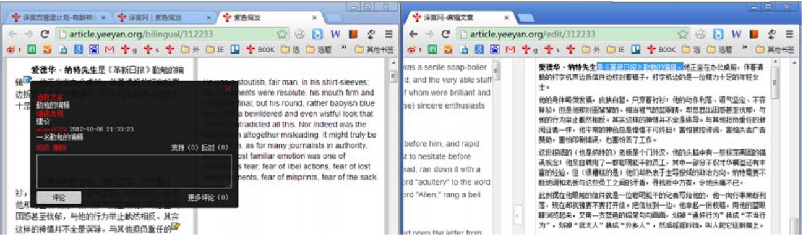

# Translators Manual
> This manual was constructed together with the style guide. The manual introduces the project, clarifies the stakeholders and the workflow. Target readers are translators, editors, reviewers, and the project manager. 
> 
**Table of Contents**
- [Translators Manual](#translators-manual)
- [01. Project Overview](#01-project-overview)
  - [1.1 Yeeyan Gutenberg Project](#11-yeeyan-gutenberg-project)
  - [1.2 English-Chinese Translation of *The Daughter of Time*](#12-english-chinese-translation-of-the-daughter-of-time)
- [02. Key Stakeholders](#02-key-stakeholders)
  - [2.1 Project Manager](#21-project-manager)
  - [2.2 Translators](#22-translators)
  - [2.3 Reviewer](#23-reviewer)
- [03. Detailed Workflow for Translators](#03-detailed-workflow-for-translators)
  - [3.1 Translation Strategy Alignment](#31-translation-strategy-alignment)
  - [3.2 Translation and Self-Revision](#32-translation-and-self-revision)
  - [3.3 Group-Revision](#33-group-revision)
  - [3.4 Proofreading for Final Edit](#34-proofreading-for-final-edit)
  - [3.5 Translation Update](#35-translation-update)
- [04. See Also](#04-see-also)

# 01. Project Overview
## 1.1 Yeeyan Gutenberg Project
[Yeeyan Gutenberg Project](http://g.yeeyan.com/), initiated by Beijing Yeeyan Xieli Technology Co., Ltd., focuses on translating open-source books, including public domain and Creative Commons licensed works. Digital publications are prioritized, with ongoing efforts to secure physical publishing opportunities. Project manager and translators will receive a share of the sales (from e-books) and royalties (from physical books).

## 1.2 English-Chinese Translation of *The Daughter of Time*
*The Daughter of Time* is a historical mystery novel by Josephine Tey. Since its first publication in 1951, it has been consistently ranked among the greatest mystery novels of all time, cementing its place in the literary canon. In 1990, the Crime Writers' Association voted it no.1 on their list of the *Top 100 Crime Novels of All Time*. In 1995, the Mystery Writers of America placed it fourth on their list of the *Top 100 Mystery Novels of All Time*.

The goal of this translation project is to produce a high-quality Chinese translation of *The Daughter of Time* that retains the novel's literary integrity, historical authenticity, and overall appeal to the target audience. The translation should accurately convey the nuances of the original text, including the characters' voices, the author's style, and the historical context.

# 02. Key Stakeholders

## 2.1 Project Manager
The project manager is the chief editor for the translation project. They are responsible for:
- selecting translators;
- monitoring project progress;
- ensuring the quality of the delivery.

The project manager can also act as a translator, when there are **at least two other translators in collaboration**. 

## 2.2 Translators
Translators are responsible for the translation, self- and group-revision, and proofreading for the subject book. The translated text should be of a publishable quality. 

**Note:** From the publication of [this book](http://g.yeeyan.org/view/2513), project managers and translators will enter into electronic contracts with Yeeyan, while physical contracts are still required for projects there before. 

## 2.3 Reviewer
The reviewer is an unofficial collaborator of the translation project, people who hold this position can be: alternate translators, freelancers, volunteer readers, publishers, etc.

# 03. Detailed Workflow for Translators 
## 3.1 Translation Strategy Alignment
Under the instruction of the project manager, translators should have a detailed discussion with each other before the translation starts, study the *Translation Style Guide* carefully, define:
- the assignment of chapters for translation;
- a timeline for the first edit, self- and group-revision, and the final edit;
- a uniform formatting style, e.g. punctuations, numbers, terms.
## 3.2 Translation and Self-Revision
To avoid the loss of any translated work, please do NOT work in the Yeeyan editor. Instead, upload your translation after it is finished. 
- When uploading your translation in the Yeeyan editor, put the number and title of the chapter under the "Title" column. Your translated chapter title can not be the same as the original title. 
- You have to finish self-revision of your translated work within a day. 
- If you need to add images to your translated text, make sure the image you use has:
  - a legal copyright;
  - a resolution of at least 1536x2048 px. 
## 3.3 Group-Revision
- Review other translators' uploaded text within a week after the upload. 
- Open the Yeeyan editor, click **Review** on the right-hand side of **Title**. Click the translated text to add headnotes. 
- Review your own translation according to other translators' headnotes. It is suggested to open two windows: one is the headnotes, and the other is your translation side-by-side with the source text.
    

## 3.4 Proofreading for Final Edit
- Proofread all the uploaded translated text before sending it to publish.
- Prepare a short paragraph (within one page) of your thoughts and comments on the book, it will be compiled into "Translator's Introduction". 
- The final edit also requires introductions of the book, the author, and highlight snippets. 
  
## 3.5 Translation Update
According to the comments from editors and readers, digital platforms where the translation will be published encourage regular update. The recommended update time is **one year** after the first publish. 

# 04. See Also 
- [Yeeyan Gutenberg Project FAQs](http://about.yeeyan.com/#/)
- [Usage and common typos of Chinese punctuations](https://reurl.cc/E1vVov)
- [Yeeyan's published books](http://g.yeeyan.com/books/onsale)