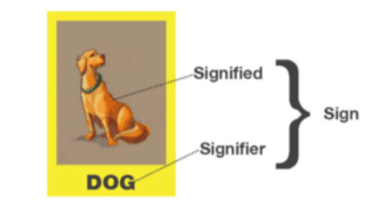

# Deciphering Humor in Translation: A Structuralist Approach through Saussure's Lens

> This is one of the article series I wrote for a communication company's educational channel. Target readers are translation students and freelance translators. 
> 
In this article, you will learn about:
- [Definition of "signifier" and "signified"](#structuralism) from Saussure's structuralist theory;
- [Insights](#insights) on how to translate humor by looking beyond "signifiers";
- [Elements to look into when translating humor](#elements-to-look-into-when-translating-humor);
- Translation [case study](#book-case) from *Is That a Fish in Your Ear?*, Chapter 25;
- Practical case study [(1)](#team-case-1)[(2)](#team-case-2) from our translation team. 
  
Estimated reading time: 10 minutes. 

# Deciphering Humor in Translation: A Structuralist Approach through Saussure's Lens

You might have heard about a joke that goes: "Someone has two parts of their brain: the 'left' and the 'right'. In the left side, there's nothing right. In the right side, there's nothing left."

Have you ever thought about how it can be translated into other languages in a way that preserves its humor for the target audience?

Before answering this question, you should know about the function of translation: Translation searches for **matching expressions** of the source texts that are acceptable to the target readers.

In the opening of Chapter 25 of *Is That a Fish in Your Ear?*, David Bellos, an English-born translator and former director of Princeton's Program in Translation and Intercultural Communication, stated that the above description of translation's function is undoubted, yet we still need to address three questions:
- What exactly is a **matching expression**? 
- What makes a match acceptable? 
- Which features of a linguistic expression can or must be matched?

These questions are challenging to answer definitively, not only for translation students but also for professionals. However, David Bellos offered a new perspective: understanding matching through the lens of Saussure's structuralism, specifically by focusing on the translation of humor. 

This article will explore how to effectively translate humor, and perhaps, readers will glean insights into what constitutes a **matching expression** in translation.

## Pattern Deciphering

It is said that Stalin and Roosevelt once debated whose bodyguard was more loyal, leading them to order their respective bodyguards to jump off a building. Roosevelt's bodyguard flatly refused, citing "thinking about the future of my family". Conversely, Stalin's bodyguard silently complied and jumped to his death. Surprised, Roosevelt asked Stalin why. Stalin chuckled, "He was thinking about the future of his family, too".

This story can be directly translated from Russian to English or from English to Chinese without modification because the humor does not rely on the linguistic features of a specific language but on the readers' interpretation of the context.

To translate witty tales of this kind, two conditions must be met:
- The punchline ("thinking about your family" in the story above) must allow for dual interpretations in both the source and target languages.
- The readers must quickly grasp that the rulers in the story would punish subordinates who disobey orders, affecting their families.

Such stories follow a pattern that, once identified, allows the joke to stand even if the characters and settings are changed. However, finding a perfect match for the original punchline in the target language remains challenging.

## Plays on Signifiers

In the structuralist theory of Ferdinand de Saussure, the Swiss linguist emphasized that meanings in language arise not from the direct relationship between words and things, but from differences and relations between **signs** within the language system itself. 

A **sign** in Saussure's model consists of two parts: 
- the **signifier**: the linguistic symbols representing concrete objects or abstract concepts, like the word DOG,
- the **signified**: the actual object or concept represented by the symbol, such as the animal "dog" in the picture below.  

In written language, humor often arises from words that look identical but have different pronunciations, making it particularly challenging to find equivalent pairs in a foreign language. This is because the humor behind phonetic rules typically applies to the source language alone.

Consider a practical example our translation team recently encountered: 

> Background: A student named "Xia Ke", which sounds like "class dismissed". 
>
> Source text (originally in Chinese):
>  
> -Teacher: Xia Ke! 
> 
> -The class stands up and shouts: Thank you, teacher! 
> 
> -Teacher: What are you doing? I said Xia Ke, not class dismissed.

If we transliterate the name, English readers might not understand the class' reaction. Such a phenomenon is known as a "Play on the Signifier", which has always been deemed "impossible" in translation, stated by Professor David Bellos.It is true because translating one language into another cannot retain the signifier. If the signifier is preserved, then what has been translated?

In the case above, if the translator does not skillfully handle the signifier ("Xia Ke"), the target readers will not grasp the special meaning this name carries.

Therefore, we need to shift our focus to what lies behind the signifier when choosing a translation strategy: the translation of "Xia Ke" should sound similar or close to "class dismissed" in the target language.

Try it yourself before we reveal the reference translation!

> Reference Translation: 
> 
> -Ms. Zhao: Carlos Owen! 
> 
> -Class: Thank you, Ms. Zhao! 
> 
> -Ms. Zhao: The class isn’t over! I was saying ‘Carlos Owen’, not ‘Class over’.

The translation gave up the literal form of "Xia Ke", neither transliterating nor explaining its meaning. Instead, it finds an English name, Carlos Owen, that phonetically resembles "class over".

Translators need to uncover the logic behind the humor and convey **the signified** to master a "Play on the Signifier".

## Translating Humor: Difficult or Impossible?

A "translation law" suggests that three elements cannot be simultaneously conveyed in translation: 
- the source reference, 
- self-reference,  
- truth-value. 

This explains why puns and word plays are challenging to translate.

What do these three elements mean? Is this law always correct? Consider the following example. 

> Background: A parody card
>
> French source text: 
> 
> Adolf Hitler - Fourreur

The French word "Fourreur" (meaning: "furrier") sounds similar to the German word "Führer" (meaning: "dictator"). This joke works only when readers understand this pun, and know who Hitler is.

In this case, 
- the **source reference** is the intended meaning -- "Hitler was a dictator", 
- the **self-reference** is the literal interpretation -- "Hitler was a furrier",
- the **truth-value** is the fact that Hitler was not a furrier, this misunderstanding arises from the phonetic similarity of these words in two languages.

Professor David Bellos stated that translating this card is not about finding an English match for the French "furrier" but focusing on the phonetic play between the target language and German, as well as the factual deviation, in order to make it funny. Bellos then provided an English translation.

> English Translation: Adolf Hitler -- German Lieder

The English "Lieder" means folk songs but sounds like "Leader", as if the person writing the card mistook "German ruler" for "German folk songs". Although not every aspect of the source text is conveyed, the translation retains the three elements mentioned in the "translation law".

Thus, "difficult to translate" does not mean it is "impossible to translate" humor. Bellos explained that difficulties in translating jokes, puns, and references arise when **translation efforts are limited to matching signifiers**. 

Our translation team has encountered a similar case. 

> Source text (originally in Chinese): 
> 
> -Student A: Because Chairman Mao said all rebels are female tigers. 
> 
> -[Everyone laughs.] 
> 
> -Teacher: Stop laughing! Chairman Mao said all rebels are paper tigers, not "female tigers". Oh, when will you ever grow up!

The source text refers to a quote by Chairman Mao, "All rebels are paper tigers". The self-reference turns this into a joke, "All rebels are female tigers". The student's slip of the tongue was unintended, as "paper tiger" and "female tiger" are only one character apart in Chinese, and the latter is a common colloquialism, making it easy to confuse.

To Chinese readers familiar with this quote, the student's mistake is obvious, and even those unfamiliar can take a hint on the humor, as "paper tiger" and "female tiger" have vastly different meanings, with the latter being colloquial and not suitable for serious contexts, hence the laughter.

Then, how should "female tiger" be handled in English?

According to Bellos's suggestion, we shouldn't limit our thinking to literal matches, i.e., not simply translate it to "female tiger" or even "tigeress".

On one hand, the expression "female tiger" in English, unlike in Chinese, is not a well-known colloquialism and lacks connotation. On the other hand, "female tiger" and "paper tiger" do not sound similar, failing to reflect the student's unintended mistake. Thus, the original's self-reference can not fully conveyed in this way.

> Reference Translation: 
> 
> -Student A: It’s because Chairman Mao said that all rebels are paper towels. 
> 
> -[The class can’t help laughing.] 
> 
> -Ms. Zhao: [Solemnly] Stop laughing! What Chairman Mao said is all rebels are paper tigers, not “paper towels”. Dear me, when are you ever going to grow up!

Did the reference translation address the nuances missed by "female tiger"? Although "paper towels" are not colloquialism, they are common household items, and because "towels" and "tigers" start with the same consonant, it sounds like a slip of the tongue, adding a touch of absurdity and humor to the narrative.

# Conclusion 

To answer our initial question: What exactly is a **matching expression**? David Bellos stated that it is elusive to provide a clear definition. Nonetheless, through all the examples and analysis of this chapter, we are sure you have some insights of your own. 

Translating humor is challenging because the punchlines often reside at the level of signifiers, which cannot be preserved in translation. This contradiction is irreconcilable, but it does not mean humor cannot be translated. As long as translators look beyond signifiers to the signified and context, good translations are achievable. 

How would you translate the witty tale at the beginning of this article? Have you encountered similar examples that turned "impossible to translate" into "possible"? Feel free to share in the comments section. See you next chapter!